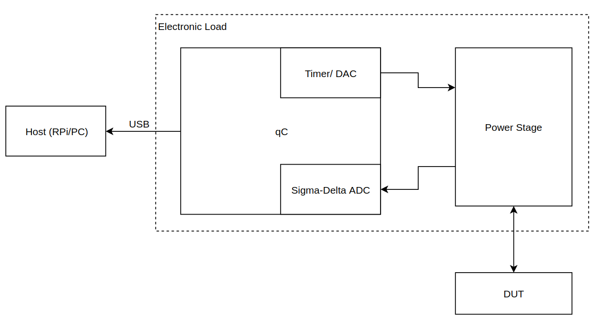

# Electronic Load DC
This project aims to design, manufacture and test Electronic Load device.

"An electronic load is a test instrument designed to sink current and absorb power out of
a power source." [Keysight, Electronic Load Fundamentals](http://literature.cdn.keysight.com/litweb/pdf/5992-3625EN.pdf)

## Introduction

Looking on the market for Electronic Load can be frustrating task (example [product range](https://uk.farnell.com/w/c/test-measurement/bench-power-supplies-sources-loads/dc-electronic-loads/prl/results?sort=P_PRICE)). One may find relatively cheap devices, but lacking good documentation. On the other hand, professional devices are not affordable for hobbyst or even for start-up. 

Having that in mind we have decided to develop own electronic load.

## Project assumptions
The following assumptions are applied during prototyping of device:
 - low component-count design
 - plug-in design - controlled via PC
 - IoT-enabled
 - automation-ready
 - safe

## Conceptual Design

### Power Stage
Can be implemented using N-mosfet because of it's simplicity in control control.
### ADC
In order to measure current and votlage A/D converter must be employed.
Sigma-Delta converters are proposed for precision of measurements and already implemented gain.
STM32F37X and 38x product range is equipped with such converters (see [application note](https://www.st.com/content/ccc/resource/technical/document/application_note/d9/90/d7/70/7c/ff/45/6d/DM00070480.pdf/files/DM00070480.pdf/jcr:content/translations/en.DM00070480.pdf))
### Isolation consideration
Proposed design is non-isolated because of USB isolation issues (see [application note](https://www.maximintegrated.com/en/design/technical-documents/app-notes/3/3891.html)). This implies some difficulties when using electronic load with non-isolated AC/DC power supplies. The one solution for this issue is using [isolation transformers](https://en.wikipedia.org/wiki/Isolation_transformer).

## Literature 
[Small Electronic Load](https://publications.lib.chalmers.se/records/fulltext/169764/169764.pdf)